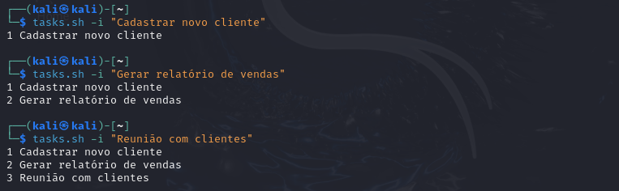
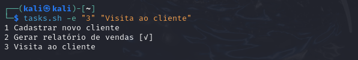
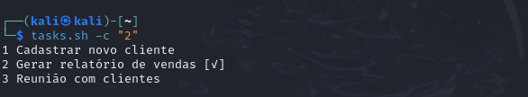
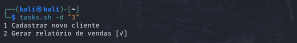
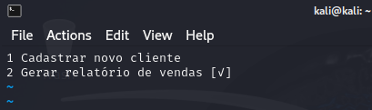

# To-do Bash Script

Desenvolvi esse projeto para práticar e aprimorar meus conhecimentos em Linux e Bash script.

## 🚀 Funcionalidades

- ✅ Adicionar uma nova tarefa
- ✏️ Editar uma tarefa existente
- ☑️ Marcar uma tarefa como concluída
- ❌ Remover uma tarefa
- 📄 Listar todas as tarefas ao final de cada comando

## Prática

Comando: `./tasks.sh -i "Tarefa"`

Ação: Inclui uma nova tarefa.

---

Comando: `./tasks.sh -e "1 Nova tarefa"`

Ação: Edita a tarefa de número 1.

---

Comando: `./tasks.sh -c "2"`

Ação: Marca a tarefa 2 como concluída.

---

Comando: `./tasks.sh -d "3"`

Ação: Exclui a tarefa de número 3.

---

Comando: `./tasks.sh -l`

Ação: Lista as tarefas.

